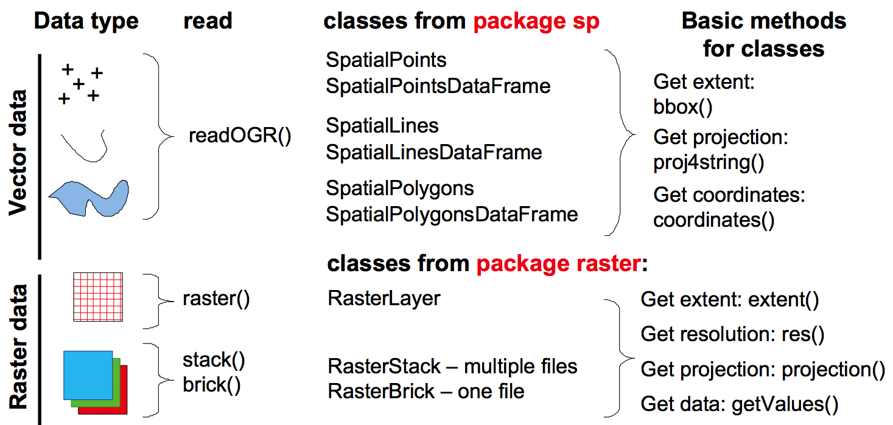
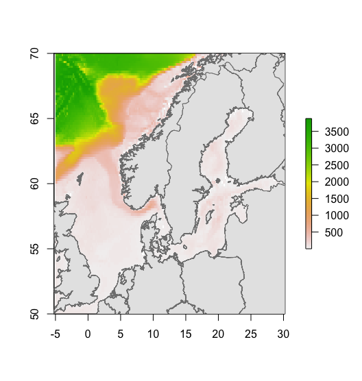
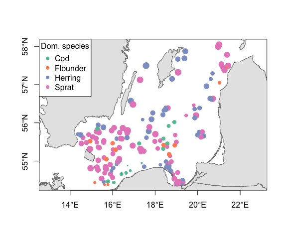
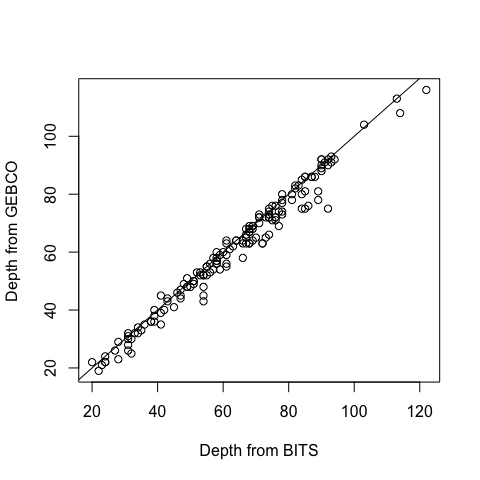
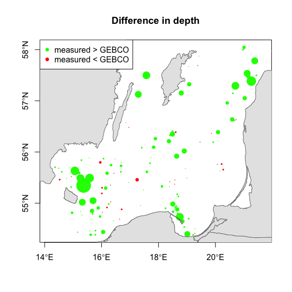
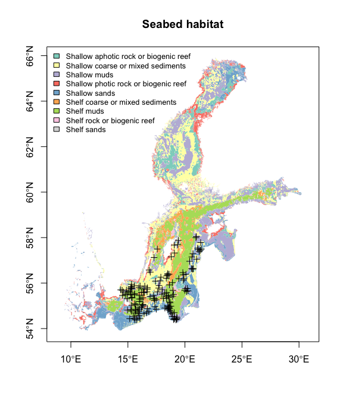
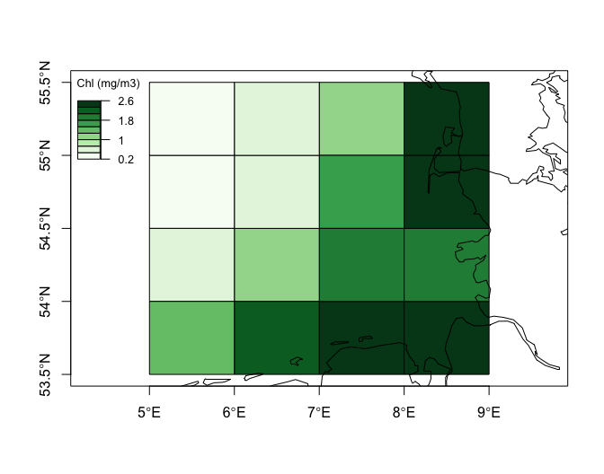
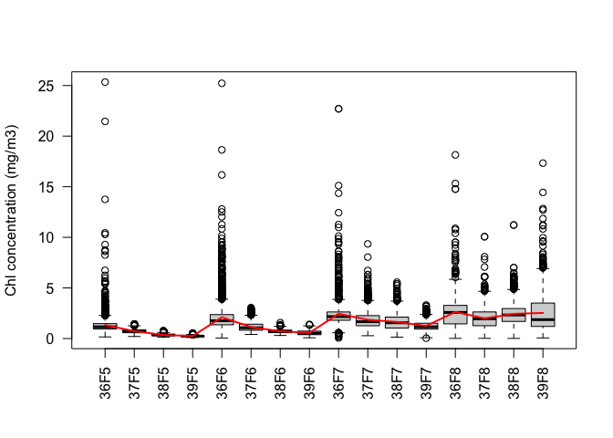

# Spatial analysis with R
Romain Frelat  
10 July 2017  

## Objectives:
* Load spatial data in R (vector and raster in different formats, including NetCDF).
* Access information from spatial data (projection system, extent, attribute table)
* Create maps  
* Overlay spatial data and extract information from raster and vectors


##A. Getting ready:

####Get the data and R script:
1. Get the zip file *SpatialR.zip* (can be downloaded: https://github.com/rfrelat/SpatialR/)
2. Unzip the archive in a new folder. The zip file contains data files, R-scripts and the present document as a pdf
3. Open the R script *script1_LoadExtractGIS.R* with your favorite R editor (RStudio is recommended)
4. Be sure to set the working directory (Session > Set Working Directory) to the directory where the script and the data are located.

####Load the needed packages and functions
In the following tutorial, we will use seven packages and some home-made functions saved in the file `MapTools.R`. Let's first, load all these needed functions:

```r
# To load and process GIS data
require(sp)
require(rgdal)
require(raster)
require(ncdf4)
#To make nicer looking maps
require(maps) 
require(mapdata)
require(RColorBrewer)
source("MapTools.R")
```
If you have an error message, check if the packages are installed. If not, install them by typing `install.packages(c("maps", "mapdata", "ncdf4", "raster", "rgdal", "RColorBrewer", "sp"))`.  
Check also that the file `MapTools.R` is in your working directory.


## B. Load spatial data

 

### B.1 Load a raster

#### Bathymetry of the Baltic Sea
The General Bathymetric Chart of the Oceans ([GEBCO](http://www.gebco.net/)) provides global bathymetry dataset with a high resolution of 30 arc-second. In  this example, the file *GEBCO2014_Subset_30Sec.tif* is a subset of the global dataset. The file is a Geotiff (an image with regular grid structure and information on projection system) and can be loaded with the function `raster`.


```r
#Set the directory of the GEBCO file
dir<-"Data/GEBCO2014_Subset_30Sec.tif" 
#Load the raster
bathy <- raster(dir) 
```

#### Information about the loaded raster


```r
#Projection system
proj4string(bathy)
```

```
[1] "+proj=longlat +datum=WGS84 +no_defs +ellps=WGS84 +towgs84=0,0,0"
```
Here the projection system is `longlat`, i.e. the coordinates are not projected, and expressed in degrees in latitude and longitude. The datum is `WGS84` (World Geodesic System 1984) which is the most common datum nowadays. This projection system (`+proj=longlat +datum=WGS84`) is very common for output of models and dataset with global coverage. In the following examples, all the data have the same projection, but one has to keep in mind that the **coordinate reference systems is an important part of spatial data, and may be a source of error**.


```r
#Extent of the dataset
bbox(bathy)
```

```
   min max
s1  -5  30
s2  50  70
```

The bathymetry data covers the rectangle defined in longitude between 5$^\circ$W and 30$^\circ$E; and in latitude between 50$^\circ$N and 70$^\circ$N.  


```r
#Dimension and resolution
dim(bathy)
```

```
[1] 2400 4200    1
```

```r
res(bathy)
```

```
[1] 0.008333333 0.008333333
```
The bathymetry grid has a dimension of 2400 x 4200 pixels and a resolution of 30 arc-second (= 0.00833$^\circ$ in decimal degree).

#### Visualize 
The easiest way to see a raster is to use the function `plot` from the `raster` package. Interesting features include defining the region plotted (with the arguments `xlim` and `ylim`), limiting the number of pixel to be plotted (to limit the processing time, argument `maxpixels`), choosing the color palette (argument `col`) and defining the breaks between the color classes (argument `breaks`). 

Here is a simple example to show the full raster and the countries around: 


```r
#Visualize the raster
plot(bathy, maxpixels = 20000)
#Add the country borders
map("worldHires", col="grey90", border="grey50", 
    fill=TRUE, add=TRUE)
```

<!-- -->


#### Your turn: 
1. Play with the arguments `xlim` and `ylim` of the function `plot()` to get a map of the Baltic Sea only (defined between 10 and 30$^\circ$E, and between 53 and 66 $^\circ$N)
2. Play with the arguments `col` to choose the palette that best fit the type of data represented and your taste (have a look at http://colorbrewer2.org/ to choose the palette, and use the function `brewer.pal()` to set the palette in R)
3. Add the country borders and a title, you should get a map similar to the one below:  

<!-- -->


#### Solution

```r
#1.
plot(bathy, xlim=c(10, 30), ylim=c(53, 66))

#2.
plot(bathy, xlim=c(10, 30), ylim=c(53, 66),
     col = brewer.pal(9,"Blues"))
#3.
plot(bathy, xlim=c(10, 30), ylim=c(53, 66),
     col = brewer.pal(9,"Blues"), 
     main="Bathymetry of the Baltic Sea")
map("worldHires", col="grey90", border="grey50", 
    fill=TRUE, add=TRUE)
```


### B.2 Load a vector 

#### Bottom trawl survey in the baltic Sea
The Baltic International Trawl Survey (BITS) is an international effort to sample the fish population in the Baltic Sea (ICES, 2014). Dataset and documentation is available on the [ICES webpage](:http://datras.ices.dk/Data_products/Download/Download_Data_public.aspx). The shapefile `Hauls_BITSTVLQ1_2016.shp` contains the position and the catches of the hauls made with a TVL gear during the first quarter of 2016. 

A shapefile is always made of multiple files (the key ones are `.shp`: the definition of the spatial object, `.prj`: the definition of the projection system, and `.dbf`: the attribute table, i.e. the data associated to each object). The function `readOGR()` will read all these files together.


```r
dir <- "Data/Hauls_BITSTVLQ1_2016.shp"
name <- "Hauls_BITSTVLQ1_2016"
hauls <- readOGR(dir,name)
```

#### Projection and extent
Similar to a raster, we can use the function `proj4string()`, `bbox()` and `dim()` to see, respectively, the projection system, the extent and the dimension of the attribute table.

```r
#See the projection
proj4string(hauls)
```

```
[1] "+proj=longlat +datum=WGS84 +no_defs +ellps=WGS84 +towgs84=0,0,0"
```

```r
#See the extent
bbox(hauls)
```

```
              min     max
coords.x1 14.3678 21.4367
coords.x2 54.3817 58.0433
```

```r
#Dimension of the attribute table
dim(hauls)
```

```
[1] 158  15
```

The projection system is the same than the raster loaded previously (geographic coordinates with the WGS84 datum). The dimension of the shapefile tells the number of the objects (here 158 points corresponding to the location of the 158 hauls) and the number of information linked to each object (15 variables). The table made of 158 rows (i.e. hauls) and 15 columns (i.e. variables) is called the *attribute table* of a shapefile. It is access in R with the symbol `@data`.

#### Attribute table

```r
#Variables in the attribute table
names(hauls@data)
```

*Table 1: Description of the variables*  

Name       | Description
-----------|---------------------------------------------
hauls      | ID of hauls 
year       | year of the haul
Gear       | Gear type used
Ship       | Ship
Lat        | Latitude
Long       | Longitude
Depth      | Depth of the haul
Area       | Subdivision
SubArea    | Depth category
Herring    | CPUE of herring (*Clupea harengus*)
Cod        | CPUE of Cod (*Gadus morhua*)
Flounder   | CPUE of Flounder (*Platichthys flesus*)
Plaice     | CPUE of Plaice (*Pleuronectes platessa*)
Sprat      | CPUE of Sprat (*Sprattus sprattus*)
TotCPUE    | Total CPUE of the 5 main species


For a proper analysis, one should conduct an exploratory analysis of this dataset to understand the distribution of each variables, and the interaction between these variables. But for brevity, we will just quickly identify the dominant species per haul.


```r
#Identify which species is the most abundant:
species <- c("Herring", "Cod", "Flounder", "Plaice", "Sprat")
abu <- hauls@data[,species]
dom_sp <- as.factor(species[apply(abu, 1, which.max)])
table(dom_sp)
```

```
## dom_sp
##      Cod Flounder  Herring    Sprat 
##       15       12       51       80
```

#### Visualize the shapefile
A shapefile can be plotted with the same function `plot()`. 


```r
plot(hauls, axes=TRUE)
#Add a background of countries border
map("worldHires", col="grey90", border="grey50", 
    fill=TRUE, add=TRUE)
```

<!-- -->

Colors (argument `col`), size (argument `cex`) and shape (argument `pch`) of the points can be changed to reflect information contained in the attribute table. As an example, we will plot the hauls with filled circle (`pch=16`), with size proportional to the total catch (log transformed), and with color indicating the dominant species of the catch. 


```r
# log transform CPUE
logCPUE <- log(hauls@data$totCPUE)

#Size of the dot, proportional to the log of total catch
size <- 2*logCPUE/max(logCPUE) #ratio between 0 and 2 of the total catch

#Set the palette of colors for the 4 dominant species
pal <- brewer.pal(4, "Set2")

#Plot the hauls with 'cex' telling the size of the dot, and 'col' the color
plot(hauls, pch=16, cex=size, col=pal[dom_sp], axes=TRUE)

#Add a background, a legend and borders
map("worldHires", col="grey90", border="grey50", 
    fill=TRUE, add=TRUE)
legend("topleft", legend = levels(dom_sp), col = pal,
       pch = 16, title="Dom. species")
```

<!-- -->


#### Your turn - Create a map of cod catches  

1. Plot the hauls with circle (`pch=16`) of size proportional to the cod CPUE (don't forget to log-transformed the CPUE).
2. Change the symbol type when cod is the dominant species into a triangle (`pch=17`). *Hint: use the function `ifelse()` to test if cod is the dominant species*
3. Add the country borders, a title and a legend. You should get a map similar to the one below:

<!-- -->

#### Solution: 

```r
#1.
#log transformed the cod catches
logcod <- log(hauls$Cod)
#Size of the dot, proportional to the total catch
size <- 2*logcod/max(logcod) #ratio between 0 and 2 of the total catch
#Plot the hauls with 'cex' telling the size of the dot
plot(hauls, pch=16, cex=size)

#2. 
pch_cod <- ifelse(dom_sp=="Cod", 17, 16)
col_cod <- ifelse(dom_sp=="Cod", "green4", "green3")
plot(hauls, pch=pch_cod, cex=size, col=col_cod)

#3.
plot(hauls, pch=pch_cod, cex=size, col=col_cod,
     main="Cod catches in 2016")
map("worldHires", col="grey90", border="grey50", 
    fill=TRUE, add=TRUE)
legend("topleft", legend = c("dominant catch", "non-dominant"), 
       col = c("green4", "green3"), pch=c(17,16))
```

## C. Crossing points and raster

#### Visually overlay raster and points
The goal of this section is to get the depth information from the raster at the position of each haul. The first step is to map them together to be sure the projections of the vector and the raster are equal and get a first idea of what should be the results. Therefore, the raster will be plotted as background and the vector object will be added on top with the argument `add=TRUE`.


```r
plot(bathy, xlim=c(13, 22), ylim=c(54, 59),
     col = brewer.pal(9,"Blues"), main="Bathymetry and hauls")
plot(hauls, add=TRUE)
map("worldHires", col="grey90", border="grey50", 
    fill=TRUE, add=TRUE)
```

<!-- -->

#### Extract information from a raster

The function to extract information from a raster corresponding to the location of a vector layer (here the shapefile) is `extract(raster, vector)`. The first arguments is the raster, the second is the vector layer.


```r
hauls_depth <- extract(bathy, hauls)
length(hauls_depth)
```

```
## [1] 158
```
The information extracted is a vector of 158 values, containing the depth value for the 158 hauls. 

#### Visualize extracted information
We can now compare the information of the depth from GEBCO, with the depth information provided by the survey.


```r
plot(hauls$Depth, hauls_depth, xlab="Depth from BITS",
     ylab="Depth from GEBCO")
abline(a=0, b=1) #add the y=x line
```

<!-- -->


#### Your turn: 
1. Calculate the difference between the depth value given in the attribute table of the shapefile and the information extracted from GEBCO. What is the maximum difference (in m)?
2. Map the depth difference with the size of the circle proportional to the absolute difference, and with colors informing the sign of the difference (green if positive, else red).
3. Add the country borders, a title and a legend. You should get a map similar to the one below:

<!-- -->

#### Solution: 

```r
#1.
depth_dif <- hauls$Depth-hauls_depth
max(abs(depth_dif)) #maximum difference : 17 meters

#2.
size_dif <- 4*abs(depth_dif)/max(abs(depth_dif))
col_dif <- ifelse(depth_dif>0, "green", "red")
plot(hauls, pch=16, col=col_dif, cex=size_dif)

#3.
plot(hauls, pch=16, col=col_dif, cex=size_dif, 
     main="Difference in depth", axes=TRUE)
map("worldHires", col="grey90", border="grey50", 
    fill=TRUE, add=TRUE)
legend("topleft", legend = c("measured > GEBCO", "measured < GEBCO"), 
       col = c("green", "red"), pch=16)
```

## D. Crossing points with polygons

### Seabed habitats
The European Marine Observation and Data Network provide data on Seabed Habitats (Cameron and Askew ,2011; http://www.emodnet.eu/). The shapefile `Baltic_Habitats_EUSEaMap2011.shp` is a simplified version of the habitat mapping carried out in 2011.


```r
dir <- "Data/Baltic_Habitats_EUSEaMap2011.shp"
name <- "Baltic_Habitats_EUSEaMap2011" 
habitats <- readOGR(dir,name)
```


**For Mac users only**:
Annoyingly, R installed on a Mac OS X takes a very long time to plot *heavy* shapefiles. A solution is to use the cairo graphic library in X11. You will have to load the package `cairo` and open a X11 windows before the next step. 

```r
#Only for mac users
require(Cairo) 
X11(type="cairo")
```


#### Your turn - Access information and visualize the shapefile 
1. Does the projection system of the habitat match the shapefile of the hauls previously loaded?
2. Are the two shapefiles overlapping? Which one has the largest extent?
3. How many variables are included in the habitat shapefile?
4. How many categories contains the variable `Grouped`?
5. Visualize (= map) the `habitat` shapefile, and represent the different values of the variable `Grouped`.
6. Add the location of the hauls (stored in variable `hauls`).
7. Last, add a legend, a title, axis and you should get a map similar to the one below.


<!-- -->

#### Solution: 

```r
#1.
proj4string(habitats) #equal to proj4string(hauls)

#2.
bbox(habitats) #larger than bbox(hauls)
# habitat and hauls data are overlapping, habitat has the largest extent 

#3. 
dim(habitats) # 4 variables
# or names(habitats)

#4.
levels(habitats$Grouped) # 9 categories
#or table(habitats$Grouped)

#5.
pal <- brewer.pal(9, "Set3")
col_hab <- pal[habitats$Grouped]
plot(habitats, col=col_hab)

#6. 
plot(hauls, add=TRUE)

#7. 
plot(habitats, col=col_hab, border=FALSE, 
     main="Seabed habitat", axes=TRUE)
legend("topleft", legend = levels(habitats$Grouped), 
       fill = pal, cex=0.7, bty="n")
plot(hauls, add=TRUE)
```

### Overlay points with polygons
To compute the spatial overlay between two vectors (e.g. points with polygons), the function `over(x, y)` makes overlay at the spatial locations of object x it retrieves the indexes or attributes from spatial object y.


```r
hauls_hab <- over(hauls, habitats) 
dim(hauls_hab)
```

```
## [1] 158   4
```
The results of the function `over()` is a data.frame with 158 rows (corresponding to our 158 hauls) and 4 columns (corresponding to the 4 variables in the habitat attribute table). 


#### Your turn - Visualize extracted information: 
1. How many hauls were carried out in "Shelf muds" habitat?
2. Is there a link between the total catch (log transformed) and the habitat type? Spatially represent the hauls with circle of size proportional to the catch, and different colors corresponding to different habitat.
3. Use `boxplot()` to visualize better the relation between catch and habitat. 

<!-- -->


#### Solution: 

```r
#1.
table(hauls_hab$Grouped)

#2.
pal <- brewer.pal(9, "Set3")
col_hab <- pal[hauls_hab$Grouped]
size <- 2*logCPUE/max(logCPUE) #ratio between 0 and 2 of the total catch
plot(hauls, pch=16, cex=size, col=col_hab, axes=TRUE)
map("worldHires", col="grey90", border="grey50", 
    fill=TRUE, add=TRUE)
legend("topleft", legend = levels(hauls_hab$Grouped), col = pal,
       pch = 16, title="Seabed habitat", cex=0.7)

#3.
#transform the variable to remove the categories with 0 observation
hauls_hab$Grouped <- as.factor(as.character(hauls_hab$Grouped))
boxplot(logCPUE~hauls_hab$Grouped, las=1, 
        xlab="total catches (in log)", horizontal=TRUE)
```

## E. Cross polygons with raster

### Load GlobColour raster
The GlobColour project provide a data set of Ocean Colour products merged from different sensors (MERIS, MODIS AQUA, SeaWIFS and VIIRS) to ensure data continuity, improve spatial and temporal coverage and reduce data noise. The data is available at daily, weekly or monthly time step with a spatial resolution of 1km over Europe (around 0.01$^\circ$) and 1/24$^\circ$ globally. Dataset can be freely downloaded at : http://hermes.acri.fr/.

The data provided here for this example is the Chlorophyll concentration (mg/m3) of July 2015 computed using the GSM model (Maritorena and Siegel, 2005). The main assumption is that phytoplankton concentration dominates over inorganic particles. The chlorophyll concentration is commonly used as a proxy for the biomass of the phytoplankton


```r
dir <- "Data/GlobColour/L3m_20150701-20150731__728672765_1_GSM-MODVIR_CHL1_MO_00.nc"
GColor072015 <- raster(dir, varname="CHL1_mean")
```

### Load ICES rectangle
We will load the shapefile `ICESrect_GermanBight.shp` containing ICES rectangles around the German Bight.

```r
dir <- "Data/ICESrect_GermanBight.shp"
name <- "ICESrect_GermanBight"
ICESrect <- readOGR(dir,name)
```

#### Your turn:
1. What is the resolution of the GlobColor raster loaded in latitude and longitude?
2. How many ICES rectangle are included in the *ICESrect_GermanBight* shapefile?
3. Do the raster and the shapefile share the same projection system?
4. Visualize the GlobColour raster in the extent of the *ICESrect_GermanBight*
5. Add the ICES rectangle
6. Add the name (variable `ICESNAME` from the attribute table) of each rectangle with the function `text()`, and add the countries border. You should get a map similar to the one below.

<!-- -->

#### Solution: 

```r
#1. 
res(GColor072015)
#0.015 in long, 0.01 in lat

#2.
dim(ICESrect)
# 16 ICES rectangles

#3.
proj4string(GColor072015)
proj4string(ICESrect)
#both layers in longlat, WGS84

#4.
bbox(ICESrect)
plot(GColor072015, xlim=c(4,10), ylim=c(53,56), 
     col=brewer.pal(9, "Greens"))

#5.
plot(ICESrect, add=TRUE)

#6.
text(ICESrect, label=ICESrect$ICESNAME, adj=1, cex=0.5)
map("worldHires", col="black", add=TRUE)
```

### Crossing polygons with raster

####Extract mean values per polygon
Our goal is to get the Chlorophyll concentration of the pixels inside each polygons. The same function `extract(raster, vector)` is used, with an extra argument `fun=`, to aggregate values per polygon.


```r
ICESGColor_mean <- extract(GColor072015, ICESrect, fun=mean, na.rm=TRUE)
dim(ICESGColor_mean)
```

```
## [1] 16  1
```
ICESGColor_mean contains 16 values corresponding to the average Chlorophyll concentration per polygons. 

#### Visualize the extracted information
We can visualize the average value in a map. The function `colscale()` create a uniform scale of colors from the given range of values and the number of colors in a palette. The function `add.colscale()` plot the color scale on a existing map.


```r
#Choose the palette colors
pal <- brewer.pal(9, "Greens")
#Create the color scale
col_mean <- colscale(ICESGColor_mean, pal)
#Map the rectangle according to the color scale
plot(ICESrect, col=col_mean$col, axes=TRUE)
#Add country border and axis
map("worldHires", col="black", add=TRUE)

#Add a color scale on the map
add.colscale(col_mean$br, pal,posi="topleft", lab="Chl (mg/m3)")
```

<!-- -->

####Extract all the pixel values per polygon
Instead of averaging the values per polygon, one can extract all the values which fit inside the polygons with the function extract (and without the argument fun=). The result is a list of 16 elements (corresponding to the 16 ICES rectangles). 

```r
ICESGColor <- extract(GColor072015, ICESrect)
typeof(ICESGColor)
```

```
## [1] "list"
```

```r
length(ICESGColor)
```

```
## [1] 16
```

```r
names(ICESGColor) <- ICESrect$ICESNAME
```

#### Visualize the variation within each polygon

A boxplot shows the variations of Chlorophyll concentration within each rectangle.

```r
boxplot(ICESGColor, las=2, ylab="Chl concentration (mg/m3)")
#add a line with the previously extracted mean
lines(ICESGColor_mean, lwd=2, col="red")
```

<!-- -->

##References

Cattell, R. B. (1966). *The scree test for the number of factors.* Multivariate behavioral research,1(2), 245-276.

Cichocki, A., Mandic, D., De Lathauwer, L., Zhou, G., Zhao, Q., Caiafa, C., & Phan, H. A. (2015). *Tensor decompositions for signal processing applications: From two-way to multiway component analysis.* IEEE Signal Processing Magazine, 32(2), 145-163.

Leibovici, D. G. (2010). *Spatio-temporal multiway decompositions using principal tensor analysis on k-modes: The R package PTAk*. Journal of Statistical Software, 34(10), 1-34.

Ward Jr, J. H. (1963). *Hierarchical grouping to optimize an objective function*. Journal of the American statistical association, 58(301): 236-244.

##Going further
Following is a list of tutorials and books that covers and go beyond the scope of this course.

- Hijmans R., *Spatial Data Analysis and Modeling with R*, http://www.rspatial.org/
- Merow C., *Ecology, Statistics and Data Science with R*, https://cmerow.github.io/RDataScience/index.html
- Wilson A., *R Data Science*, http://adamwilson.us/RDataScience/index.html
- Lovelace R., *Introduction to visualising spatial data in R*, http://github.com/Robinlovelace/Creating-maps-in-R
- Hengl, T. (2009). *A practical guide to geostatistical mapping*, Free book that can be download at : http://spatial-analyst.net/book/system/files/Hengl_2009_GEOSTATe2c1w.pdf
- Bivand R., Pebesma E. and Gomez-Rubio V., (2013) *Applied Spatial Data Analysis with R*, UseR! Series, Springer, 405pp.
