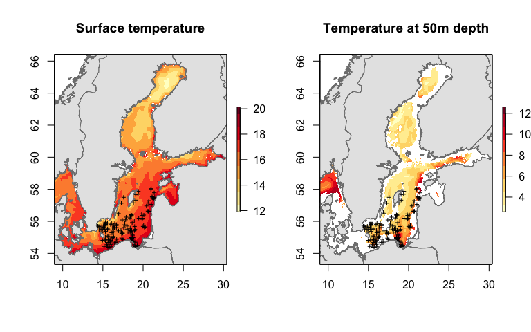
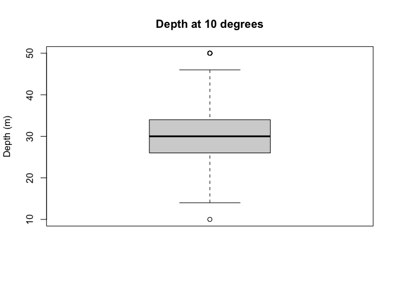
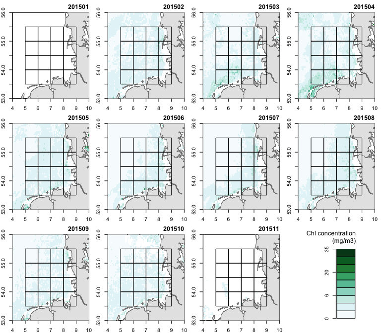
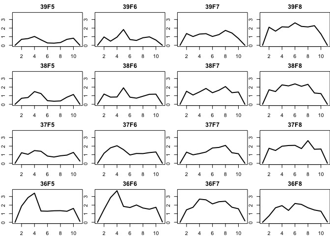

# Spatial analysis with R
Romain Frelat  
10 July 2017  

## Objectives:
  * Understand the organization of multidimensional data
  * Explore the temperature-depth profile of the Baltic Sea
  * Observe the seasonal pattern of primary production in the German Bight
  * Strengthen your GIS and mapping skills


##A. Introduction:

#### Network Common Data Form (NetCDF):
In the previous session, we saw that the function `raster()` was able to load one raster (i.e. one value per pixel). The Unidata’s Network Common Data Form (NetCDF) was created to answer the needs of oceanographers and climatologists to save, share and process their multidimensional data. The raster package offers two different objects to load multidimensional rasters (multiple information for each pixel, like a 3D cube) and efficiently process them, `brick` (if information gathered in one file) and `stack` (if information spread in multiple files)

To read multidimensional NetCDF file, the loading function (either `raster()`, `brick()` or `stack()` depending on the object type created) have 3 additional parameters:  

- `varname`: a character representing the variable name, such as "temp".
- `lvar`: integer > 0. To select the 'level variable' (3rd dimension variable) to use when the file has more than 3 dimensions.
- `level`: integer > 0. To select the 'level' (the 4th dimension variable) to use when the file has more than 3 dimensions.


####Get ready:
1. Get the zip file *SpatialR.zip* (can be downloaded: https://github.com/rfrelat/SpatialR/)
2. Unzip the archive in a new folder. The zip file contains data files, R-scripts and the present document as a pdf
3. Open the R script *script2_MultiExamples.R* with your favorite R editor (RStudio is recommended)
4. Be sure to set the working directory (Session > Set Working Directory) to the directory where the script and the data are located.

####Load the package and needed functions
In the following tutorial, we will use seven packages and some home-made functions saved in the file `MapTools.R`. Let's first, load all these needed functions:

```r
# To load and process GIS data
require(sp)
require(rgdal)
require(raster)
require(ncdf4)
#To make nicer looking maps
require(maps) 
require(mapdata)
require(RColorBrewer)
source("MapTools.R")
```
If you have an error message, check if the packages are installed. If not, install them by typing `install.packages(c("maps", "mapdata", "ncdf4", "raster", "rgdal", "RColorBrewer", "sp"))`.  
Check also that the file `MapTools.R` is in your working directory.


## B. Temperature-depth profile of the Baltic Sea

### B.1 Load and vizualize the data

####Load the temperature-depth layer
The Baltic Sea Physics Reanalysis was produced in 2014 at SMHI with the circulation model HIROMB (High- Resolution Operational Model for the Baltic). The data has a resolution of 3 nautical miles (5.5 km) and cover the period 1989 – 2015. It provides, among other informations, 3D fields of temperature and salinity. The present data was downloaded from the Copernicus Marine Environment Monitoring Service (CMEMS). In the following, we will focus only on the temperature in July 2015.  

We want to load multidimensional information from one NetCDF file, so we will use create a `brick` object, loading only the temperature (`varname="temp"`) and having depth as a third dimension (`lvar=4`).

```r
dir <- "Data/CMEMS_SMHI_PHYS_reanalysis_201507.nc"
temp072015 <- brick(dir, varname="temp", lvar=4)
```

The same functions `proj4string()`, `dim()` and `res()` can be used to describe the brick object.

```r
proj4string(temp072015)
```

```
[1] "+proj=longlat +datum=WGS84 +ellps=WGS84 +towgs84=0,0,0"
```

```r
dim(temp072015)
```

```
[1] 242 257  50
```

```r
res(temp072015)
```

```
[1] 0.08333333 0.05000000
```
The matrix is 242x257 pixels (in longitude x latitude) and has information for 50 depth layers.
The depth layers' values are stored in the `z` attribute of the brick object.

```r
#Get the depth values
depth <- temp072015@z[[1]]
#See the depth layers
depth
```

```
 [1]   2.0   6.0  10.0  14.0  18.0  22.0  26.0  30.0  34.0  38.0  42.0
[12]  46.0  50.0  54.0  58.0  62.0  66.0  70.0  74.0  78.0  82.5  87.5
[23]  92.5  97.5 102.5 108.0 114.0 120.0 126.5 133.5 141.0 149.5 159.0
[34] 169.5 182.0 197.5 216.5 240.0 269.0 303.0 340.5 380.0 420.0 460.0
[45] 500.0 540.0 580.0 620.0 660.0 700.0
```
The depth layers are from 2m to 700m depth, with an increasing interval between depth layer (from a 4m interval near the surface to a 40m interval at the bottom).

#### Load the hauls shapefile
We will extract the temperature profile of July 2015 for the hauls positions of BITS carried out in the first quarter of 2016. Let's load the shapefile *Hauls_BITSTVLQ1_2016.shp*.

```r
dir <- "Data/Hauls_BITSTVLQ1_2016.shp"
name <- "Hauls_BITSTVLQ1_2016"
hauls <- readOGR(dir,name)
```

#### Visualize
One of the key step before extracting values is to visualize the two datasets. The function `plot()` can create a map of a `brick` object, with the added parameters `y` telling which layer to be plotted. We will overlay the surface temperature (`y=1`) and the hauls. 

```r
plot(temp072015, y=1, main="Surface temperature in July 2015", 
     col= brewer.pal(9,"YlOrRd"))
plot(hauls, add=TRUE, cex=0.5)
map("worldHires", col="grey90", border="grey50", 
    fill=TRUE, add=TRUE)
```

<!-- -->

#### Your turn: 
1. Which depth layer represent the 50m depth?
2. Make a similar map than the one for the surface temperature, but for the 50m depth temperature. 

#### Solution

```r
#1
which(depth==50) #13th layer reprensent 50m depth
#2
plot(temp072015, y=13, main="Temperature at 50m depth", 
     col= brewer.pal(9,"YlOrRd"))
plot(hauls, add=TRUE, cex=0.5)
map("worldHires", col="grey90", border="grey50", 
    fill=TRUE, add=TRUE)
```

### B.2 Extract values
The values are extracted with the function `extract()`. The output is a matrix, with in rows the different points (i.e. hauls), and in columns the different depth layer.

```r
haul_temp <- extract(temp072015, hauls)
dim(haul_temp) #158 hauls x 50 depth layer
```

```
[1] 158  50
```

```r
colnames(haul_temp) <- depth
```

We saw in the previous session that all the hauls were carried out between 20m and 120m depth, so we will remove the columns that correspond to a layer deeper than 120m (and full of NA as it can be seen with `apply(is.na(haul_temp),2,sum)`)

```r
haul_temp <- haul_temp[,depth<=120]
depth <- depth[depth<=120]
```

### B.3 Get surface and bottom temperature
The surface teperature is stored in the first column of the matrix `haul_temp`. The bottom temperature is more complex, because the bottom corresponds to different depth layer for different hauls. So first, we have to identify the bottom for each haul, which is the last columns with no NA value for each row. 


```r
#Surface temperature: first column
sst <- haul_temp[,1] 

#Identify the bottom for each haul
bottom <- apply(!is.na(haul_temp), 1, sum)
#Bottom temperature
sbt <- haul_temp[cbind(1:nrow(haul_temp),bottom)]
```

To represent the extracted values in a map by different colors, we will use the functions `colscale()` to assign a color according to a uniform scale of temperature and `add.colscale()` to add the color scale on the image. For example, let's represent the surface temperature of the hauls:

```r
#Choose the color palette
pal <- brewer.pal(9, "YlOrRd")
# Assign a color to each haul according to sst
col_sst <- colscale(sst, pal)
#Plot the hauls
plot(hauls, col=col_sst$col, pch=16, axes=TRUE,
     main="Surface temperature in July 2015")
#Add the country borders
map("worldHires", col="grey90", border="grey50", 
    fill=TRUE, add=TRUE)
#Add the color scale
add.colscale(col_sst$br, pal, posi="topleft", 
             lab="Temperature", cex=0.7)
```

<!-- -->

#### Your turn: 
1. Make a similar map representing the bottom temperature.
2. Add the information of total catches, with a variation of size of the circle (proportional to the log transformed catches).
3. What is the maximum difference between the surface and the bottom temperature? Is there a relation between the range of temperature (SST-SBT) and depth? 

<!-- -->

#### Solution

```r
#1.
# Assign a color to each haul according to sst
col_sbt <- colscale(sbt, pal)
#Plot the hauls
plot(hauls, col=col_sbt$col, pch=16,
     main="Bottom temperature")
#Add the country borders
map("worldHires", col="grey90", border="grey50", 
    fill=TRUE, add=TRUE)
#Add the color scale
add.colscale(col_sbt$br, pal, posi="topleft", 
             lab="Temperature", cex=0.7)

#2.
#ratio between 0 and 2 of the total catch (in log)
size <- 2*log(hauls$totCPUE)/log(max(hauls$totCPUE)) 
#Create a map
plot(hauls, col=col_sbt$col, pch=16, axes=TRUE,
     main="Bottom temperature", cex=size)
map("worldHires", col="grey90", border="grey50", 
    fill=TRUE, add=TRUE)
#Add the color scale
add.colscale(col_sbt$br, pal, posi="topleft", 
             lab="Temperature", cex=0.7)

#3.
max(sst-sbt) #13.4 degrees C
plot(sst-sbt,-hauls$Depth, xlab="SST-SBT", ylab="Depth")
```


### B.4 Visualize the thermocline

The value extracted are not only bottom and surface temperature but the full temperature-depth profile for each point. We can visualize the temperature-depth profile for the 158 points (i.e. hauls) using a `for` loop to draw a line for each point.


```r
plot(haul_temp[1,], -depth , type="l", , col="grey30",
     xlim=range(haul_temp, na.rm=TRUE), xlab="Temperature",
     ylab="Depth", las=1)
for (i in 2:nrow(haul_temp)){
  lines(haul_temp[i,],-depth, col="grey30")
}
```

<!-- -->

From the graphic above, the thermocline can be identified as the strong drop in temperature between 15 and 5 degrees. A good proxy of the thermocline depth could be the depth at which the temperature is 10 degrees.


```r
#Detect the depth when the temperature is pass the 10 degrees threshold
depth10 <- depth[apply(haul_temp>10, 1, sum, na.rm=TRUE)]
#remove the hauls which never reach lower temperature than 10 degrees
depth10[sbt>10] <- NA
#Visualize the distribution of the depth at 10 degrees
boxplot(depth10, ylab="Depth (m)", main="Depth at 10 degrees")
```

<!-- -->

#### Your turn: 
1. Create a color scale of the depth at 10 degrees (function `colscale()`)
2. Show the spatial distribution (= make a map) of the depth at 10 degrees.
3. Verify that the depth at 10 degrees is a good proxy for the depth of the thermocline by representing the temperature-depth profiles with the same color scale (corresponding to the depth at 10 degrees).

You should get something like:  

<!-- -->

#### Solution

```r
#1
# Assign a color to each haul according to depth at 10 degrees
col_dp10 <- colscale(depth10, pal)

#2
#Create a map
plot(hauls, col=col_dp10$col, pch=16, axes=TRUE,
     main="Depth at 10 degrees", cex=size)
map("worldHires", col="grey90", border="grey50", 
    fill=TRUE, add=TRUE)
#Add the color scale
add.colscale(col_dp10$br, pal,posi="topleft", 
             lab="Depth (m)")

#3
plot(haul_temp[1,], -depth , type="l", xlim=range(haul_temp, na.rm=TRUE),
     xlab="Temperature", ylab="Depth", las=1, col=col_dp10$col[1])
for (i in 2:nrow(haul_temp)){
  lines(haul_temp[i,],-depth, col=col_dp10$col[i])
}
abline(v=10, lty=3)
```


## C Seasonality of primary production in the North Sea

### C1. Load and vizualize the data

####Load the monthly primary production of 2015 per depth layer
The GlobColour project provide a continuous data set of Ocean Colour products merged from different sensors (MERIS, MODIS AQUA, SeaWIFS and VIIRS) to ensure data continuity, improve spatial and temporal coverage and reduce data noise. The data is available at daily, weekly or monthly time step with a spatial resolution of 1km over Europe (around 0.01$^\circ$) and 1/24$^\circ$ globally. Dataset can be freely downloaded at : http://hermes.acri.fr/.

The data provided here for this example is the monthly Chlorophyll concentration (mg/m3) computed using the GSM model (Maritorena and Siegel, 2005). The main assumption is that phytoplankton concentration dominates over inorganic particles. The chlorophyll concentration is commonly used as a proxy for the biomass of the phytoplankton

We want to load all the files from GlobColor corresponding to the year 2015. The function `list.files()` make a list of all the files in a given folder with a given pattern in the name (using regular expressions, visit http://www.regexr.com/ for more information). 


```r
#list all the files in GlobColour folder finishing by "00.nc"
file.names<-list.files("Data/GlobColour", pattern="00.nc$", 
                       full.names = TRUE)
length(file.names)
```

```
[1] 11
```

```r
# Getting the date of each file from the file name
# The date is between position 21 and 26.
time<-substr(file.names, 21,26)
time
```

```
 [1] "201501" "201502" "201503" "201504" "201505" "201506" "201507"
 [8] "201508" "201509" "201510" "201511"
```

There are 11 files corresponding to the year 2015. The month of December is absent, because all the values are 0, there are no primary production in December in our area of interest.

#### Load a stack object
To load multiple files in a multidimensional raster, we will create a `stack` object, loading the Chlorophyll concentration (`varname="CHL1_mean"`).


```r
GColor2015<-stack(file.names, varname="CHL1_mean")
names(GColor2015) <- time
```
The functions `proj4string()`, `dim()` and `res()` can be used to describe a `stack` object.

```r
proj4string(GColor2015)
```

```
[1] "+proj=longlat +datum=WGS84 +ellps=WGS84 +towgs84=0,0,0"
```

```r
dim(GColor2015)
```

```
[1] 1201 2001   11
```

```r
res(GColor2015)
```

```
[1] 0.015 0.010
```
The array is 1201x2001 pixels (in longitude x latitude) and has information for 11 time steps. 

#### Load the ICES rectangle
We will extract the primary production for the 16 ICES rectangles around the German Bight. So we have to load the shapefile *ICESrect_GermanBight.shp*.


```r
dir <- "Data/ICESrect_GermanBight.shp"
name <- "ICESrect_GermanBight"
ICESrect <- readOGR(dir,name)
```

#### Visualize
The primary production is skewed with lots of low values and few outliers with very high values, so we will define a non-uniform color scale that represent well the small variations in Chl. Then, we can plot with the same color scale the 11 months with a loop `for`, incrementing the value of argument `y`. 


```r
#Define manually the color breaks
brk <- c(0,1,3,6,10,15,20,25,30,35)
#Define the color palette
pal <- brewer.pal(9, "BuGn")
#Plot the 11 months
par(mfrow=c(3,4), mar=c(2,2,2,1))
for (i in 1:length(time)){
  #show the primary production of time i
  image(GColor2015, y=i, main="", xlim=c(4,10), 
        ylim=c(53, 56), col=pal, breaks=brk)
  #add the country borders
  map("worldHires", col="grey90", border="grey50", 
      fill=TRUE, add=TRUE)
  #add the ICES rectangle
  plot(ICESrect, add=TRUE)
  #add the title - the time
  title(time[i], adj=1)
}
#Add the color scale in a separate plot
par(mar=c(2,8,4,4))
plot.scale(brk, pal = pal, lab="Chl concentration\n(mg/m3)")
```

<!-- -->

### C2. Extract monthly primary production in ICES rectangle
The function `extract()` used with polygons can aggregate values per polygon with the argument `fun=`. The issue here is that the pixel with a chlorophyll concentration of 0 are saved as NA, so they will be removed from the average calculation. In order to have a correct estimate of the average primary production, we need to calculate the sum per polygon and then dividing it per the number of pixel per polygons.


```r
#compute the sum per polygon
ICESGColor_sum <- extract(GColor2015, ICESrect, fun=sum, na.rm=TRUE)
#get the number of pixel with non-na values
lena <- function(dat, ...){return(sum(!is.na(dat)))}
ICESGColor_length <- extract(GColor2015, ICESrect, fun=lena)
#calculate the correct average
ICESGColor_mean <- ICESGColor_sum/apply(ICESGColor_length,1,max)
dim(ICESGColor_mean)
```

```
## [1] 16 11
```
The extracted information are stored in `ICESGColor_sum`, `ICESGColor_length` and `ICESGColor_mean`, three data.frames of 16 rows (corresponding to the 16 ICES rectangles) and eleven columns (corresponding to the 11 months). 

### C3. Visualize the seasonal pattern
We can plot the average seasonal pattern of the ICES rectangle. The function `layout` is a flexible framework that allow us to make multiple plot, matching the spatial distribution of the ICES rectangle. 


```r
#Layout to match the ICES spatial distribution
layout(matrix(c(4:1, 8:5, 12:9, 16:13), byrow = FALSE, ncol=4))
#Plot the seasonal primary production
par(mar=c(2,2,2,0))
for (i in 1:nrow(ICESGColor_mean)){
  plot(ICESGColor_mean[i,], ylim=range(ICESGColor_mean), lwd=2, 
       type="l", main=ICESrect$ICESNAME[i])
}
```

<!-- -->

#### Your turn: 
1. Extract the maximum chl concentration from the seasonal averages per ICES rectangle (*hint*: use the function `apply`)
2. Extract the month of the maximum chl concentration per ICES rectangle (*hint*: again, use the function `apply`).
3. Represent both the maximum primary production (as color scale) and the month (as text) on a map.

You should get something like:  

<!-- -->

#### Solution

```r
#1
maxNPP<- apply(ICESGColor_mean, 1, max)

#2
maxSea<- apply(ICESGColor_mean, 1, which.max)
maxSea.abb <- month.abb[maxSea]

#3
pal <- brewer.pal(9, "Greens")
colNPP <- colscale(maxNPP, pal)
plot(ICESrect, col=colNPP$col, axes=TRUE, 
     main="Seasonal pic of primary production")
#use of rgb() to have transparency
map("worldHires", col=rgb(0.7,0.7,0.7, alpha=0.5), 
    border="grey50", fill=TRUE, add=TRUE)
text(ICESrect, maxSea.abb)
add.colscale(colNPP$br, pal, posi="bottomright", rd=0,
             lab="chl (mg/m3)", cex=0.7)
```

