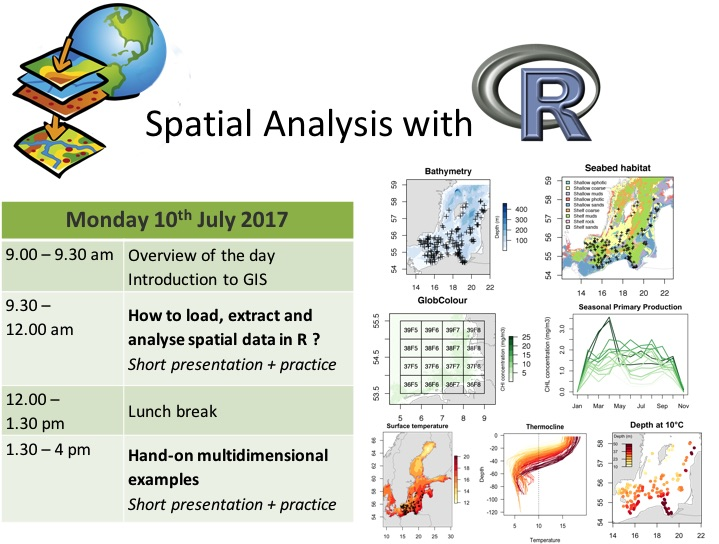

# SpatialR - Spatial analysis with R for Marine scientists

## The aims of this workshop is to : 
- Feel more comfortable to work with spatial data 
- Load spatial data in R and visualise it
- Extract information from remote sensing or model dataset
- Take advantage of the numerous databases that are available online

The data, guidelines and scripts can be downloaded in the [SpatialR.zip](https://github.com/rfrelat/SpatialR/raw/master/SpatialR.zip) archive.
The workshop is divided in two section of approx. 2h each. 

## 1. How to load, extract and analyse spatial data in R?
See [1_LoadExtractGIS](https://rfrelat.github.io/Spatial1_LoadExtractGIS.html) for guidelines
- Load spatial data in R (vector and raster in different formats, including NetCDF). 
- Access information from spatial data (projection system, extent, attribute table) 
- Create maps
- Overlay spatial data and extract information from raster and vectors

## 2. Hands-on multidimensional examples
See [2_MultiExamples](https://rfrelat.github.io/Spatial2_MultiExamples.html) for guidelines
- Understand the organisation of multidimensional data
- Explore the temperature-depth profile of the Baltic Sea
- Observe the seasonal pattern of primary production in the German Bight 
- Strengthen your GIS and mapping skills

Enjoy !!

Romain Frelat, 10th July 2017

 
